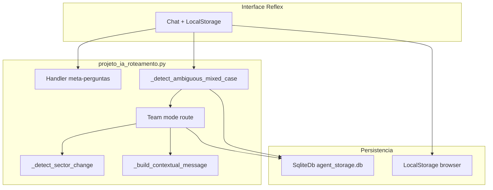

# Relatório Técnico: Bot de Suporte Institucional com Roteamento Inteligente

**Disciplina:** Inteligência Artificial  
**Tema:** 7 — Bot de suporte com roteamento inteligente  
**Alunos:** Breno Ricardo Ferreira Antunes, Larissa e Thiago  
**Data:** Junho de 2026  
**Entrega final:** `projeto_ia_roteamento.py` (portal Reflex)

---

## 1. Introdução e Motivação

O atendimento de suporte em instituições de ensino superior frequentemente enfrenta problemas de triagem ineficiente. Alunos enviam solicitações para departamentos incorretos, o que gera retrabalho e atrasos na resolução das demandas.

Este projeto desenvolve um sistema inteligente capaz de receber solicitações em linguagem natural, identificar o departamento responsável (TI ou Secretaria Acadêmica) e encaminhar a solicitação com o contexto adequado. A entrega final é um **portal web** construído com **Reflex**, executado via `reflex run`, adequado para demonstração ao vivo em sala de aula.

O projeto atende diretamente aos requisitos do Tema 7:
- Classificação de intenção
- Roteamento correto para agentes especialistas
- Manutenção de contexto entre interações
- Correção de roteamento quando o assunto muda na mesma sessão
- Avaliação de casos ambíguos

---

## 2. Arquitetura do Sistema

O sistema utiliza uma arquitetura **Team em modo de roteamento** (`mode="route"`), composta por três agentes:

- **Roteador (Orquestrador):** analisa a intenção e delega via `delegate_task_to_member`, ou faz triagem conversacional quando a intenção é vaga.
- **Agente de TI:** problemas técnicos (senhas, login, sistemas, infraestrutura).
- **Agente da Secretaria Acadêmica:** questões administrativas (matrícula, documentos, trancamento, histórico).

### Evolução do projeto

| Fase | Arquivo | Papel |
|------|---------|-------|
| Semana 1 — protótipo | `bot.py` | Agente mínimo CLI; traces históricos em `testes/traces/` |
| Entrega final — MVP | `projeto_ia_roteamento.py` | Portal Reflex + memória persistente + correção de rota |

### Características do MVP

- `Team(mode="route")` como roteador principal
- `SqliteDb` (`agent_storage.db`) com `session_id` e `num_history_messages=12`
- `LocalStorage` no navegador para histórico visual do chat
- `_build_contextual_message()` injeta as últimas 4 mensagens da UI no prompt
- `_detect_ambiguous_mixed_case()` trata casos ambíguos na primeira mensagem: quando há termo administrativo (ex.: diploma) e falha técnica (ex.: site fora do ar) na mesma frase, encaminha diretamente para TI
- `_detect_sector_change()` corrige roteamento quando o aluno muda de setor na mesma sessão (ex.: de Secretaria para TI ao mencionar `login`)
- Handler local para perguntas meta ("qual foi minha última dúvida?")

A comunicação entre agentes ocorre pela ferramenta interna `delegate_task_to_member`. Em casos ambíguos ou de correção de rota, o sistema pode chamar o agente especialista diretamente (sem passar pelo Team), mantendo o mesmo `session_id`.

---

## 2.1 Metodologia de Desenvolvimento e Uso de Inteligência Artificial

O desenvolvimento foi iterativo, com auxílio das IAs Grok (xAI) e Gemini (Google) para diagnóstico de erros, evolução da arquitetura, criação dos casos de teste e redação deste relatório.

Principais etapas:
- Protótipo CLI (`bot.py`) com `Team(mode="route")`
- Evolução para MVP Reflex com `SqliteDb` e persistência no navegador
- Correção de roteamento híbrido que conflitava com o Team nos casos ambíguos
- Reforço do caso diploma + site fora do ar com `_detect_ambiguous_mixed_case()` após instabilidade do modelo em testes manuais
- Bateria de 10 testes automatizados (`testes/testar_roteamento.py`) — **100% de acerto**
- Captura de traces do MVP (`testes/salvar_traces.py`) em `testes/traces/projeto_ia_roteamento/`

A utilização da IA foi transparente e os resultados foram validados manualmente por execução real dos testes e análise dos traces.

---

## 3. Tecnologias Utilizadas

| Componente | Tecnologia | Justificativa |
|------------|------------|---------------|
| Framework de Agentes | AGNO | Teams com roteamento nativo e memória de sessão |
| Modelo de Linguagem | Google Gemini 3.1 Flash-Lite | Velocidade e bom desempenho em classificação |
| Interface Web | Reflex 0.9 | MVP demonstrável ao vivo no navegador |
| Persistência Agno | SqliteDb | Memória de sessão entre mensagens |
| Gerenciamento de API | python-dotenv | Chave fora do código-fonte |
| Ambiente | Python 3.13 | Compatível com AGNO e Reflex |

Configuração: arquivo `.env` com `GOOGLE_API_KEY` e `.gitignore` impedindo versionamento da chave.

---

## 4. Análise dos Reasoning Traces

Foram realizadas **10 execuções reais** do MVP. Os traces completos estão em `testes/traces/projeto_ia_roteamento/`. Abaixo, a análise de **5 traces representativos** (requisito do núcleo comum).

**Diferença em relação aos traces antigos (`testes/traces/`):** os traces do MVP mostram `SqliteDb` ativo (sem aviso de histórico ausente) e refletem o fluxo real do portal Reflex.

### Trace 1 – Roteamento para TI (Caso Simples)

**Arquivo:** `trace_01_ti.txt`  
**Prompt:** "Minha senha do portal do aluno não funciona."

**Análise:**
- O Team iniciou com `Team Run Start` e disponibilizou `delegate_task_to_member`.
- O roteador identificou intenção técnica e delegou com `member_id: equipe-de-ti`.
- O agente de TI executou `Agent Run Start` e respondeu com passos em markdown.
- **Ferramentas:** `delegate_task_to_member` → resposta do membro TI.
- **Resultado:** Correto.

### Trace 2 – Roteamento para Secretaria (Caso Simples)

**Arquivo:** `trace_02_secretaria.txt`  
**Prompt:** "Quero cancelar minha matrícula, como faço?"

**Análise:**
- O roteador reconheceu natureza administrativa.
- Delegou com `member_id: secretaria-academica`.
- O agente respondeu com tom formal e procedimentos burocráticos.
- **Resultado:** Correto.

### Trace 3 – Caso Ambíguo (Decisão Técnica)

**Arquivo:** `trace_03_ti_ambiguo.txt`  
**Prompt:** "Preciso do diploma, mas o site de emissão está fora do ar."

**Análise:**
- Caso ambíguo: menciona documento (diploma) e falha técnica (site fora do ar).
- No trace capturado, o Team priorizou o problema técnico e delegou via `delegate_task_to_member` para `equipe-de-ti`.
- Em testes manuais posteriores, o mesmo prompt chegou a ser roteado para a Secretaria (variabilidade do modelo). Para garantir consistência, foi adicionada `_detect_ambiguous_mixed_case()`, que encaminha diretamente para TI quando administrativo e falha técnica coexistem na mesma mensagem.
- O agente de TI forneceu diagnóstico e passos de verificação.
- **Resultado:** Correto. Combina raciocínio do Team com regra de reforço para casos mistos críticos.

### Trace 4 – Correção de Rota com Histórico

**Arquivos:** `trace_08_secretaria.txt` + `trace_09_correcao_rota_ti.txt`  
**Prompt 1:** "Onde pego o comprovante de matrícula para o estágio?"  
**Prompt 2:** "E se eu esquecer o meu login na hora de baixar?" (mesma sessão)

**Análise:**
- Na primeira mensagem, roteamento para Secretaria (correto).
- Na segunda, o trace mostra `active_sector: secretaria` e chamada direta ao `Agent ID: equipe-de-ti`.
- O mecanismo `_detect_sector_change()` identificou o termo `login` e redirecionou para TI, injetando o histórico via `_build_contextual_message()`.
- O prompt enviado ao agente TI inclui o aviso: *"a nova mensagem contém termos técnicos (login, senha, acesso, erro)"*.
- **Resultado:** Excelente. Atende o requisito do Tema 7 de "permitir correção de roteamento".

### Trace 5 – Triagem do Orquestrador

**Arquivo:** `trace_10_triagem_orquestrador.txt`  
**Prompt:** "Olá, boa tarde! Gostaria de ajuda."

**Análise:**
- O Team recebeu a mensagem com contexto da mensagem de boas-vindas.
- **Não** chamou `delegate_task_to_member`; respondeu diretamente perguntando se o problema é TI ou Secretaria.
- Badge exibido: `Assistente IA` (sector: `orchestrator`).
- **Resultado:** Comportamento adequado. Evita roteamento incorreto em intenção vaga.

---

## 5. Avaliação Crítica e Resultados

### 5.1 Metodologia de teste

- **Script de validação:** `python testes/testar_roteamento.py`
- **Captura de traces:** `python testes/salvar_traces.py`
- **Documentação dos casos:** `testes/casos_de_teste.md`

### 5.2 Avaliação Quantitativa

| Métrica | Resultado |
|---------|-----------|
| Total de testes | 10 |
| Roteamentos corretos | 10 |
| Taxa de acerto | **100%** |
| Casos ambíguos testados | 3 (ID 03, 06 e 09) |
| Correção de rota na sessão | Sim (ID 09) |
| Memória Agno (SqliteDb) | Ativa |
| Memória visual (LocalStorage) | Ativa |

### 5.3 Avaliação Qualitativa

**Pontos fortes:**
- 100% de acerto na bateria automatizada do MVP
- Roteamento inteligente via Team nos casos claros e ambíguos
- Triagem segura em mensagens genéricas (caso 10)
- Correção de rota na mesma sessão (caso 09)
- Interface Reflex pronta para demonstração ao vivo
- Memória em duas camadas (Agno + navegador)

**Pontos de melhoria:**
- Respostas dos agentes ainda são genéricas (prazos, URLs fictícias)
- API Gemini free tier impõe limite de requisições por minuto (erro 429 em testes rápidos)
- `_detect_ambiguous_mixed_case()` e `_detect_sector_change()` usam sinais léxicos como reforço — poderiam ser 100% LLM com mais testes e fine-tuning

**Padrões de erro observados:**
Nenhum erro grave de roteamento nos 10 casos. Não foram observados loops infinitos nem alucinações críticas.

---

## 6. Limitações e Melhorias Futuras

**Limitações atuais:**
- Dependência da API Gemini (conectividade e rate limit)
- LocalStorage não sincroniza entre dispositivos ou navegadores
- Sem integração com sistemas reais do IFES (portal, SIGAA, etc.)
- Respostas geradas dinamicamente, sem base documental institucional

**Melhorias futuras:**
- **RAG** com documentos oficiais do IFES
- Novos agentes (Financeiro, Coordenação)
- Sincronização de sessão em backend próprio
- Avaliação automática contínua da qualidade das respostas

---

## 7. Conclusão

O projeto cumpriu os objetivos do Tema 7. A arquitetura `Team` em modo `route` do AGNO mostrou-se eficaz para triagem inteligente, complementada por memória persistente (`SqliteDb`), interface Reflex e correção de roteamento.

O MVP alcançou **100% de acerto** nos 10 casos testados, incluindo ambíguos e correção de rota. Os reasoning traces do MVP (`testes/traces/projeto_ia_roteamento/`) comprovam delegação correta, triagem segura e uso de histórico de sessão. Camadas de reforço (`_detect_ambiguous_mixed_case` e `_detect_sector_change`) complementam o Team onde a variabilidade do modelo exigiu maior previsibilidade.

O trabalho atende ao núcleo comum da disciplina: ambiente configurado, agente mínimo (`bot.py`), análise de traces, avaliação crítica, relatório técnico e portal demonstrável via `reflex run`.

---

**Referências**
- Documentação oficial do AGNO
- Especificação do Projeto Final de Inteligência Artificial – Prof. Dr. Sérgio Nery Simões